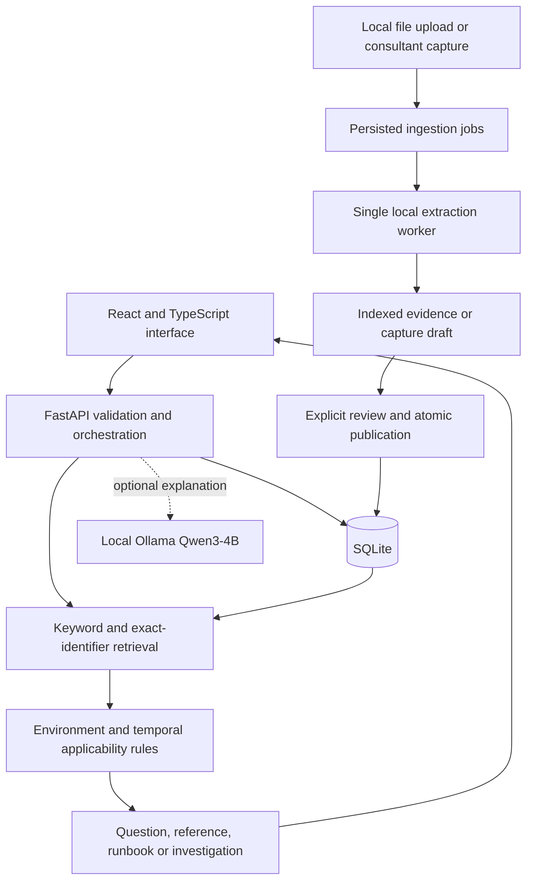

# Solution Atlas

A working, local support-intelligence prototype. Find prior resolutions, check their applicability against recorded system changes, inspect evidence, and turn a consultant's verified resolution into reviewed, searchable knowledge.

**Authentication is intentionally excluded.** The server binds to `127.0.0.1`; this is a single-user demonstration, not a shared enterprise deployment. The built-in incidents, procedures, systems, and change history are synthetic.

## Run

The dependencies and frontend build have been prepared on this machine. From this project folder:

```powershell
python -m backend.run
```

Open **http://127.0.0.1:8000**. API documentation: http://127.0.0.1:8000/docs.

For a fresh installation, use Python 3.11+ and Node.js 22:

```powershell
python -m venv .venv
.venv\Scripts\python.exe -m pip install -r backend/requirements.txt
npm install
npm run build
.venv\Scripts\python.exe -m backend.run
```

The current machine uses Python 3.14. An ignored `.runtime/vendor` cache supplies the pure-Python PDF reader for offline development; normal installations obtain it from `requirements.txt`.

For frontend development, run the backend in one terminal and `npm run dev` in another. Vite serves port 5173 and proxies `/api` to port 8000. Restart the backend after the first production build so its static-assets mount is registered.

## Working features

| Area | Implemented behavior |
|---|---|
| Incident workspace | Create/filter incidents, select a mock system, analyze evidence, answer a diagnostic question |
| Retrieval | Term-frequency cosine matching plus exact error identifiers; source text and section references |
| Applicability | Component, release and deployment prerequisites; missing-history handling; scoped changes since verification |
| Answer routing | Quick reference, diagnostic question, reviewed runbook, or investigation/escalation |
| Evidence | Source-type colors, exact stored paragraphs, document ID and version, explicit match signals |
| System timeline | Record mock applied changes; distinguish unknown impact from known incompatibility |
| Revalidation | Record verification against a procedure version and system revision; cannot override hard mismatches |
| Knowledge capture | Capture steps and observed verification → index draft → review → publish atomically → retrieve |
| Ingestion | Upload text PDF, DOCX body text, Markdown, text, CSV and JSON; job state and errors; content deduplication |
| Outcome memory | Record success, failure or unknown; show failed attempts for the same incident |
| Freshness | Flag displayed results when recorded context/evidence changes; reject stale local-model requests |
| Local generation | Optional Ollama `qwen3:4b` explanation with source-ID validation and one generation at a time |

An uploaded source is searchable evidence. It does **not** become an approved executable procedure automatically. Draft captures remain excluded from normal retrieval until the exact indexed version is published. Review is a local workflow, not an authenticated role.

## Try the demonstration

1. **SYN-1042:** Analyze the approval timeout. Inspect the older workaround and incompatible embedded-deployment alternative. Answer the alternate-path question to see the appropriate routing.
2. **SYN-1043:** Analyze the stalled batch. Inspect the unsuccessful prior restart. In System timeline, record an unknown-impact change for Operations integrations, then analyze again. Record mock revalidation from the solution library to restore applicability.
3. **SYN-1044:** Initially has no precedent. Capture a verified resolution, wait for indexing, approve it in Review queue, and test the new precedent. Browser verification has already completed this flow in the current local demo, so a captured example is present.
4. **SYN-1045:** Shows a compact quick-reference answer.

To get fresh seed data without deleting anything, stop the server and set `ATLAS_DATA_DIR` to a **new** directory before restarting:

```powershell
$env:ATLAS_DATA_DIR = Join-Path $env:LOCALAPPDATA 'SolutionAtlas\fresh-demo'
python -m backend.run
```

Default storage is `%TEMP%\solution-atlas\local-prototype`. It survives application restarts but the operating system can clear temporary files. Use the environment override above for data you want to keep. SQLite and uploaded files remain in that directory; copy the directory with the server stopped for a simple backup.

## Architecture



- **Frontend:** React 19, TypeScript, Vite, Lucide icons and custom responsive CSS. Six screens; no login, registration, roles, sessions or identity provider.
- **Backend:** FastAPI/Pydantic validates requests and runs deterministic decisions. The model can explain selected evidence; it cannot change applicability or replace the reviewed steps.
- **Database:** SQLite in WAL mode. Separate collections for incidents, systems, documents, passports (reviewed procedures), changes, validations, outcomes, gaps, drafts, jobs and analyses. Records are JSON inside named tables in this prototype; this is not yet the normalized PostgreSQL schema in the blueprint.
- **Middleware:** Host/origin checks for the localhost application, input validation, error mapping, no-store responses, revision checks, transactional publication and outcome idempotency. A persistent job table plus one worker replaces a separate queue service. Interrupted running jobs return to queued on restart.
- **Storage:** Uploaded files use generated local filenames. Extracted sections retain inspectable text. No OCR, live connectors or cloud storage.

## Local AI and hardware

There are no paid APIs or cloud services. The application works without a GPU or model server. Ollama is currently unavailable on this machine, so model generation is disabled visibly; the running search and rules are **not** presented as generated AI.

If Ollama and `qwen3:4b` are installed later, start Ollama and reload the page. The adapter uses localhost only, disables thinking, requests a 2,048-token context and caps output at 250 tokens. Its speed and VRAM fit have **not** been benchmarked here. A 4 GB GPU may require CPU offload. Model explanations remain subject to human inspection even when their source IDs validate.

## Verification

```powershell
python -m pip install -r backend/requirements-dev.txt
python -m unittest discover -s backend/tests -v
npm run build
```

Tests use isolated directories under `.runtime/tests`; they do not modify the demo database. Browser checks exercised diagnosis → runbook, source inspection, and capture → indexing → publication → reuse.

## Next implementation milestones

The full target architecture remains in `SOLUTION_BLUEPRINT.md`. This runnable first increment uses SQLite and keyword retrieval so it can run with the available machine dependencies.

Still to implement: local semantic embeddings and hybrid retrieval, a normalized PostgreSQL/pgvector backend, independently benchmarked retrieval quality, richer diagnostic branches, draft editing/rejection and supersession, live permission-aware connectors, source deletion/version synchronization, retry controls and hardened multi-worker ingestion. Time-based ranking decay and calibrated success probabilities are not implemented; applicability currently depends on recorded context and changes, not an arbitrary age discount.

Authentication remains outside this build's scope. No commands are executed on SAP or other enterprise systems.
